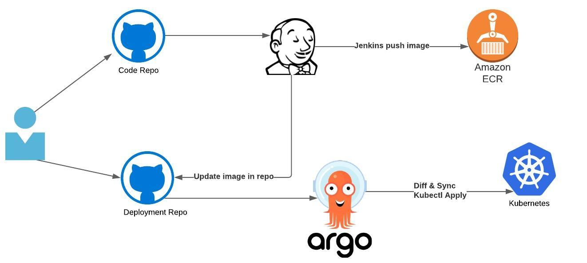

# GitOps-Pipeline
In this project we will build a GitOps Pipeline.The Pipeline has two repos.A Code repo and and a Deployment repo.The code repo houses the movie site app.Code repo can be found [here](https://github.com/BrianSandiford/moviesiteapp).When a change is made to the code repo( a commit) it triggers the Jenkin CI pipeline.Jenkins builds the Docker image ,pushes it to Amazon ECR (Amazon Elastic Container Registry (ECR) ) and also updates the image tag in the Deployment repo.Deployment repo can be found [here](https://github.com/BrianSandiford/moviesiteapp-helmcharts).ArgoCD listens to the Deployment repo and once the change in image tag is noticed syncs with the kubernetes environmemt ( Amazon Elastic Kubernetes Service (EKS)).


## Create EC2 instance

##  Install Jenkins on AWS EC2
Instructions on installing Jenkins on AWS EC2 can be found [here](https://github.com/yankils/Simple-DevOps-Project/blob/master/Jenkins/Jenkins_Installation.MD#install-jenkins-on-aws-ec2). 

Select "install suggested pluggins " after installation.

Install git plugin on Jenkins.Instructions [here](https://github.com/yankils/Simple-DevOps-Project/blob/master/Jenkins/Git_plugin_install.MD)

Install Docker Pipeline Pluggin in Jenkins.

Install CloudBees Docker Build and Publish plugin.

Install Pipeline pluggin.

## Install Docker on AWS EC2
Instructions on installing Docker on AWS EC2 can be found [here](https://docs.aws.amazon.com/AmazonECS/latest/developerguide/docker-basics.html)
Add your jenkins user to the docker group:
``` 
sudo usermod -aG docker jenkins
```
Then restart your jenkins server to refresh the group.

## Create Kubernetes (K8s) Cluster on AWS

1. install AWSCLI 

Instructions on installing AWSCLI version 2 can be found [here](https://docs.aws.amazon.com/cli/latest/userguide/install-cliv2-linux.htmll)
2. Login to AWS 

``` 
# Access your "My Security Credentials" section in your profile. 
# Create an access key


# Regions
https://docs.aws.amazon.com/AmazonRDS/latest/UserGuide/Concepts.RegionsAndAvailabilityZones.html

```

3. Install kubectl on EC2 instance 
Instructions on installing kubectl can be found [here](https://docs.aws.amazon.com/cli/latest/userguide/install-cliv2-linux.html)

4. Deploy Cluster with EKS CLI  https://docs.aws.amazon.com/eks/latest/userguide/getting-started-eksctl.html 
## Install EKS CTL

Instructions on installing eksctl can be found [here](https://docs.amazonaws.cn/en_us/eks/latest/userguide/eksctl.html)

Set the path as below :
```
export PATH=$PATH:/usr/local/bin/
```
```
eksctl create cluster --name getting-started-eks \
--region us-east-2 \
--version 1.16 \
--managed \
--node-type t2.small \
--nodes 1 \
--node-volume-size 200 
```

Cleanup
```
eksctl delete cluster --name getting-started-eks
```

## Define Jenkins Pipeline
- Define Jenkins Pipeline in SCM.Instructions [here](https://www.jenkins.io/doc/book/pipeline/getting-started/#through-the-classic-ui)
above.
- In the Jenkinsfile within the **Code** repo the field **git-pass-credentials-ID** needs to be defined as as a Username with password credential in Jenkins `withCredentials([usernameColonPassword(credentialsId: 'git-pass-credentials-ID', variable: 'USERPASS')])'` 

## Install Argo CD
Instructions on installing Argo CD can be found [here](https://argo-cd.readthedocs.io/en/stable/getting_started/)

Under step 6. Create An Application From A Git Repository replace example repo https://github.com/argoproj/argocd-example-apps.git with Code repo 
https://github.com/BrianSandiford/moviesiteapp-helmcharts.git

Give your app the name moviesiteapp instead of guestbook

Change SYNC POLICY to automatic

CHECK PRUNE RESOURCES and SELF HEAL check boxes


PATH would simply be a period '.'


`kubectl -n argocd get all` should provide the server IP/hostname	`argocd login <ARGOCD_SERVER>`

Server hostname hightlighted in yellow below


## Webhooks
Confgure webhook in your repository. Example [here](https://docs.github.com/en/developers/webhooks-and-events/creating-webhooks)

## Finally
A git push should trigger the build.
